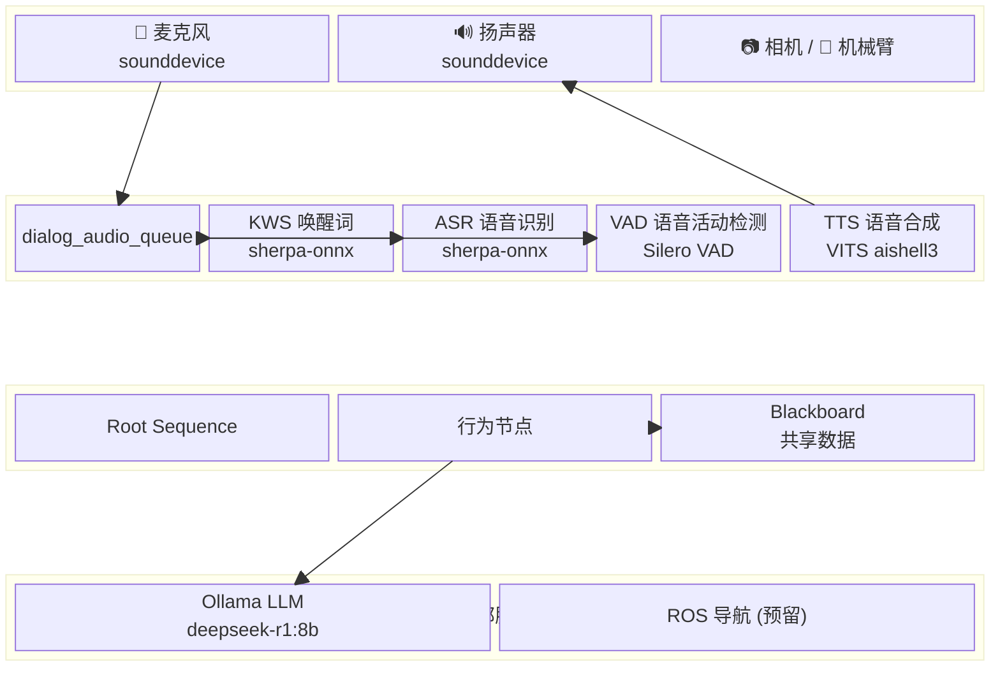
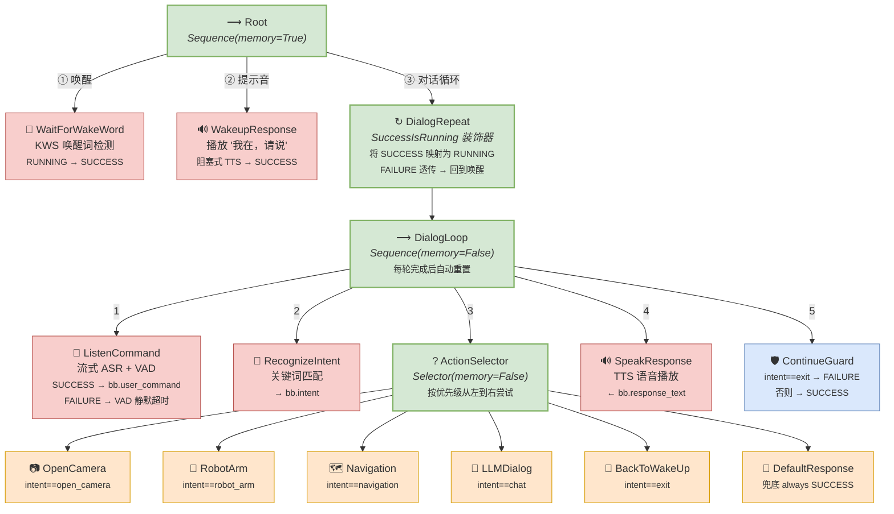
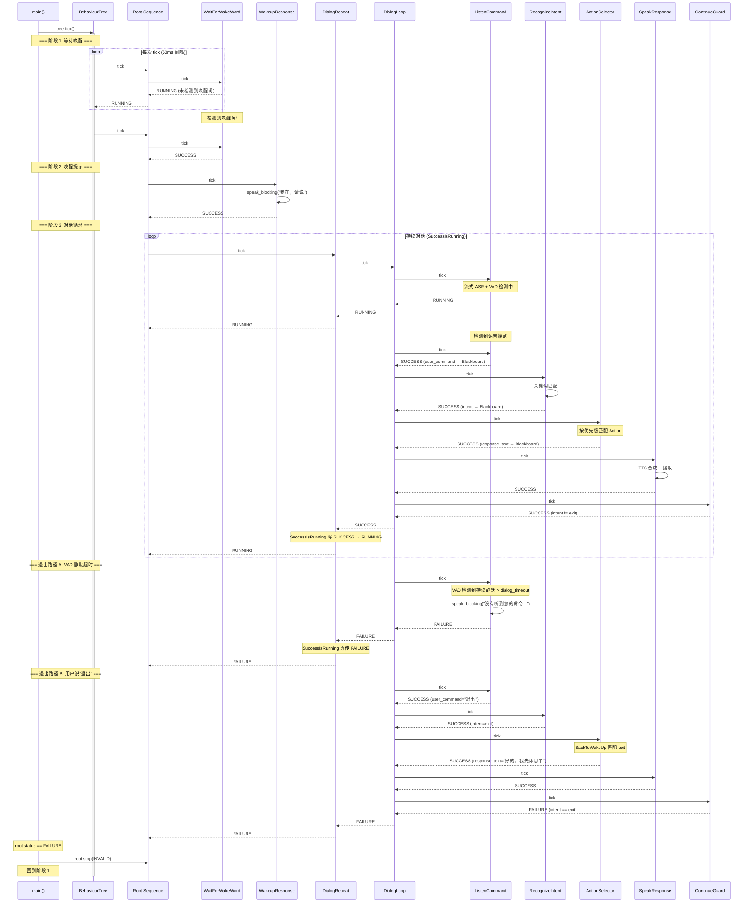
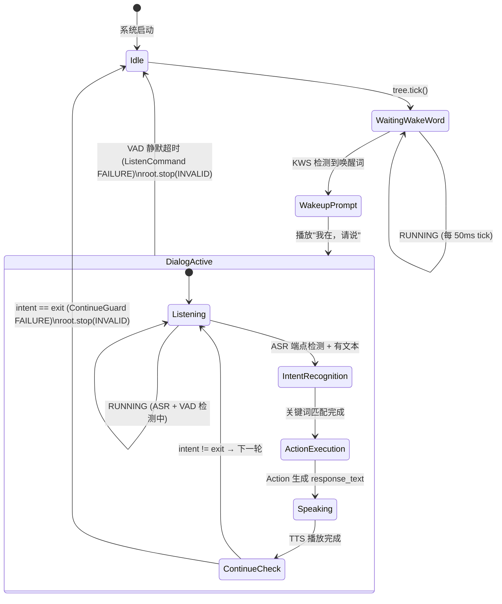
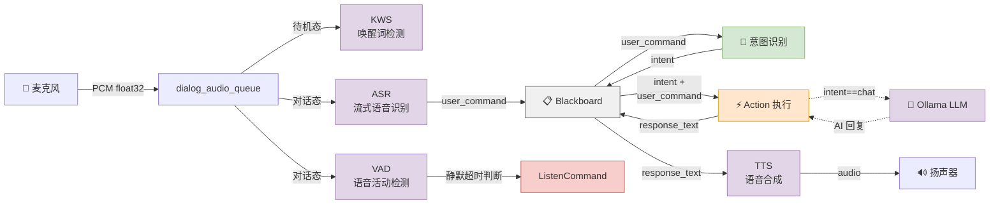
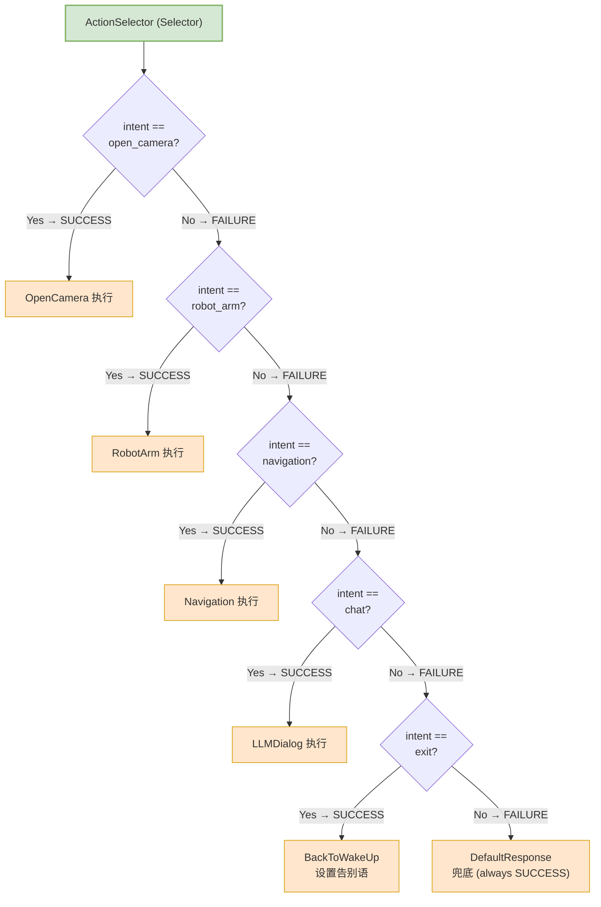

# 机器人语音助手 (Robot Voice Assistant)

基于 [py_trees](https://py-trees.readthedocs.io/) 行为树实现的语音交互系统。通过行为树的 tick 驱动机制，将唤醒词检测、语音识别、意图分发、动作执行、语音合成等模块组织成可维护、可扩展的树形结构。

## 目录

- [系统架构](#系统架构)
- [行为树结构](#行为树结构)
- [运行流程](#运行流程)
- [数据流](#数据流)
- [节点详解](#节点详解)
- [Blackboard 数据共享](#blackboard-数据共享)
- [项目结构](#项目结构)
- [依赖与安装](#依赖与安装)
- [配置说明](#配置说明)
- [运行](#运行)

---

## 系统架构

> 详细的可编辑架构图见 [`docs/architecture.drawio`](docs/architecture.drawio)，使用 [draw.io](https://app.diagrams.net/) 打开（含 3 个页签：系统架构、行为树详细结构、数据流向图）。



系统分为四层：

| 层级 | 组件 | 职责 |
|------|------|------|
| **硬件层** | 麦克风、扬声器、相机、机械臂 | 音频采集与播放、外设交互 |
| **语音引擎** | `VoiceEngine` | 管理 KWS/ASR/VAD/TTS 模型，维护音频队列 |
| **行为树** | `py_trees.BehaviourTree` | 决策调度核心，tick 驱动所有节点 |
| **外部服务** | Ollama LLM、ROS（预留） | 大模型对话、机器人导航 |

---

## 行为树结构

这是系统的核心设计。行为树通过 `tick()` 循环驱动，每次 tick 从根节点递归向下执行，节点返回 `SUCCESS`、`FAILURE` 或 `RUNNING` 三种状态。



### 关键设计决策

| 节点 | 类型 | memory | 原因 |
|------|------|--------|------|
| **Root** | Sequence | `True` | WakeWord SUCCESS 后记住状态，后续 tick 直接进入对话，不再重复唤醒 |
| **DialogRepeat** | SuccessIsRunning | - | 将 DialogLoop 的 SUCCESS 映射为 RUNNING，使对话持续循环；FAILURE 透传，触发回到唤醒 |
| **DialogLoop** | Sequence | `False` | 每轮对话完成后自动重置，从 Listen 重新开始下一轮 |
| **ActionSelector** | Selector | `False` | 每次都从头匹配，按优先级逐个尝试 action |
| **ContinueGuard** | Leaf | - | DialogLoop 末尾守卫：`intent == "exit"` 时返回 FAILURE 打断循环 |

### 回到唤醒的两条路径

| 触发条件 | 触发节点 | FAILURE 传播链路 |
|----------|----------|-----------------|
| VAD 检测到持续静默超过 `dialog_timeout` 秒 | `ListenCommand` → FAILURE | DialogLoop → SuccessIsRunning 透传 → Root FAILURE → `root.stop(INVALID)` |
| 用户说"退出/结束/停止/没事了" | `DialogContinueGuard` → FAILURE | DialogLoop → SuccessIsRunning 透传 → Root FAILURE → `root.stop(INVALID)` |

---

## 运行流程

### 主循环时序图



### 状态机视图



---

## 数据流

节点之间通过 py_trees 的 **Blackboard** 机制传递数据，所有键都在 `dialog` 命名空间下。



---

## 节点详解

### 控制节点 (Composite / Decorator)

| 节点 | 类型 | 说明 |
|------|------|------|
| `Root` | `Sequence(memory=True)` | 根节点，按顺序执行唤醒→提示→对话循环。`memory=True` 保证唤醒后不再重复检测 |
| `DialogRepeat` | `SuccessIsRunning` 装饰器 | 将 `DialogLoop` 的 SUCCESS 转换为 RUNNING，实现无限对话循环；FAILURE 透传触发回到唤醒 |
| `DialogLoop` | `Sequence(memory=False)` | 单轮对话流程：听→识别→执行→说→守卫。`memory=False` 每轮自动重置 |
| `ActionSelector` | `Selector(memory=False)` | 意图分发器，从左到右尝试匹配 action，第一个 SUCCESS 胜出 |

### 叶子节点 (Leaf Behaviour)

| 节点 | 文件 | 功能 | Blackboard I/O |
|------|------|------|----------------|
| `WaitForWakeWord` | `nodes/wake_word.py` | 持续监听麦克风，检测到唤醒词返回 SUCCESS | 无 (直接消费 audio_queue) |
| `WakeupResponse` | `nodes/speak.py` | 播放唤醒提示音 "我在，请说" (阻塞式 TTS) | 无 |
| `ListenCommand` | `nodes/listen.py` | 流式 ASR + VAD 检测。ASR 端点+有文本→SUCCESS；VAD 静默超时→FAILURE (播放超时提示后回到唤醒) | Write: `user_command`, `last_activity_time` |
| `RecognizeIntent` | `nodes/intent.py` | 关键词匹配意图，无匹配则设为 `chat` | Read: `user_command` / Write: `intent` |
| `OpenCameraAction` | `nodes/actions/camera.py` | 打开相机拍照 (OpenCV) | Read: `intent` / Write: `response_text` |
| `RobotArmAction` | `nodes/actions/robot_arm.py` | 控制机械臂 (预留接口) | Read: `intent`, `user_command` / Write: `response_text` |
| `NavigationAction` | `nodes/actions/navigation.py` | ROS 导航 (预留接口) | Read: `intent`, `user_command` / Write: `response_text` |
| `LLMDialogAction` | `nodes/actions/llm_dialog.py` | LLM 自由对话，通过 langchain-ollama 连接 Ollama | Read: `intent`, `user_command` / Write: `response_text` |
| `BackToWakeUp` | `nodes/actions/back_to_wakeup.py` | 退出动作：`intent == "exit"` 时设置告别语并 SUCCESS | Read: `intent`, `user_command` / Write: `response_text` |
| `DefaultResponse` | `nodes/actions/default_response.py` | 兜底响应，始终 SUCCESS | Read: `user_command` / Write: `response_text` |
| `SpeakResponse` | `nodes/speak.py` | 阻塞式 TTS 播放 response_text | Read: `response_text` / Write: `is_speaking`, `speak_start_time`, `last_activity_time` |
| `DialogContinueGuard` | `nodes/guards.py` | 对话循环守卫：`intent == "exit"` 时 FAILURE 终止循环，否则 SUCCESS | Read: `intent` |

### Action 节点的 Selector 匹配逻辑

每个 Action 节点在 `update()` 中首先检查 `blackboard.intent` 是否匹配自身的意图名称：
- **匹配** → 执行业务逻辑 → 返回 `SUCCESS`
- **不匹配** → 直接返回 `FAILURE`，Selector 继续尝试下一个



---

## Blackboard 数据共享

py_trees 的 Blackboard 是节点间共享数据的中心化存储，采用命名空间隔离。本项目所有键均在 `dialog` 命名空间下：

| 键名 | 类型 | 写入者 | 读取者 | 说明 |
|------|------|--------|--------|------|
| `user_command` | `str` | ListenCommand | RecognizeIntent, Actions | ASR 识别出的用户语音文本 |
| `intent` | `str` | RecognizeIntent | 所有 Action 节点 | 识别出的意图名称 |
| `response_text` | `str` | Action 节点 | SpeakResponse | 待播放的回复文本 |
| `is_speaking` | `bool` | SpeakResponse | InterruptMonitor | TTS 是否正在播放 |
| `speak_start_time` | `float` | SpeakResponse | InterruptMonitor | TTS 播放开始时间戳 |
| `last_activity_time` | `float` | ListenCommand, SpeakResponse | InterruptMonitor | 最后一次活动时间 (用于超时检测) |
| `interrupted` | `bool` | InterruptMonitor | - | 是否被用户打断 |

---

## 项目结构

```
pytree_learing/
├── main.py                          # 入口：构建行为树 + 主循环
├── engine.py                        # VoiceEngine：管理 KWS/ASR/VAD/TTS 模型和音频流
├── config.py                        # RobotConfig：所有可配置参数 (pathlib 路径)
├── nodes/
│   ├── __init__.py                  # 节点模块导出
│   ├── wake_word.py                 # WaitForWakeWord - 软件唤醒词检测
│   ├── hw_wake_word.py              # HardwareWakeWord - 硬件唤醒 (RK3328)
│   ├── listen.py                    # ListenCommand - 流式 ASR + VAD 静默超时
│   ├── intent.py                    # RecognizeIntent - 意图识别
│   ├── speak.py                     # SpeakResponse + WakeupResponse - TTS
│   ├── guards.py                    # DialogContinueGuard - 对话循环守卫
│   ├── interrupt.py                 # InterruptMonitor - 打断监控 (预留)
│   └── actions/
│       ├── __init__.py
│       ├── camera.py                # OpenCameraAction - 相机
│       ├── robot_arm.py             # RobotArmAction - 机械臂
│       ├── navigation.py            # NavigationAction - ROS 导航
│       ├── llm_dialog.py            # LLMDialogAction - LLM 对话
│       ├── back_to_wakeup.py        # BackToWakeUp - 退出回到唤醒
│       └── default_response.py      # DefaultResponse - 兜底响应
├── docs/
│   ├── architecture.drawio          # draw.io 可编辑架构图 (3 页)
│   ├── voice_assistant_tree.png     # 行为树可视化 (py_trees 生成)
│   ├── voice_assistant_tree.svg
│   └── voice_assistant_tree.dot
├── model/                           # 模型文件目录 (gitignore)
├── examples/
│   └── pytree_lifycycle.py          # py_trees 生命周期演示
├── pyproject.toml
└── uv.lock
```

---

## 依赖与安装

### 前置条件

- Python >= 3.11
- [uv](https://docs.astral.sh/uv/) 包管理器
- [Ollama](https://ollama.ai/) (运行 LLM 对话需要)
- 麦克风和扬声器硬件

### 语音模型

需要下载 [sherpa-onnx](https://github.com/k2-fsa/sherpa-onnx) 模型文件，放置到 `config.py` 中 `MODELS_BASE` 指定的路径：

| 模型 | 用途 | 文件/目录名 |
|------|------|--------|
| zipformer-bilingual-zh-en | 流式 ASR (中英双语) | `sherpa-onnx-streaming-zipformer-bilingual-zh-en-2023-02-20/` |
| kws-zipformer-wenetspeech | 关键词检测 (KWS) | `sherpa-onnx-kws-zipformer-wenetspeech-3.3M-2024-01-01/` |
| VITS aishell3 | TTS 语音合成 (174 音色) | `vits-zh-aishell3/` |
| Silero VAD | 语音活动检测 (静默超时) | `silero_vad.onnx` |

### 安装依赖

```bash
# 克隆项目
git clone <repo-url>
cd pytree_learing

# 使用 uv 安装依赖
uv sync

# 拉取 LLM 模型 (可选，用于自由对话)
ollama pull deepseek-r1:8b
```

### 核心依赖

| 包 | 版本 | 用途 |
|---|---|---|
| `py-trees` | >= 2.4.0 | 行为树框架 |
| `sherpa-onnx` | >= 1.12.23 | KWS / ASR / TTS 推理引擎 |
| `sounddevice` | >= 0.5.5 | 音频采集与播放 |
| `numpy` | latest | 音频数据处理 |
| `langchain-ollama` | latest | LLM 对话接口 |
| `langchain-core` | latest | LangChain 消息类型 |
| `opencv-python` | >= 4.13.0 | 相机拍照 (可选) |

---

## 配置说明

所有参数集中在 `config.py` 的 `RobotConfig` dataclass 中，修改后无需改动业务代码：

```python
@dataclass
class RobotConfig:
    # 唤醒词
    kws_keywords_file: str = "..."     # 唤醒词文件路径
    kws_keywords_threshold: float = 0.25

    # TTS 音色 (aishell3: sid 0~173)
    tts_speaker_id: int = 21
    tts_speed: float = 1.0

    # VAD (语音活动检测)
    vad_threshold: float = 0.5         # 语音检测阈值
    vad_min_silence_duration: float = 0.25
    vad_min_speech_duration: float = 0.25

    # 对话
    dialog_timeout: float = 10.0       # VAD 无活动超时 (秒)

    # LLM
    llm_model: str = "deepseek-r1:8b"
    llm_base_url: str = "http://localhost:11434"

    # 意图关键词映射
    intent_patterns: dict = {
        "open_camera": ["打开相机", "拍照", ...],
        "robot_arm":   ["机械臂", "抓取", ...],
        "navigation":  ["导航", "前往", ...],
        "exit":        ["退出", "结束", "停止", "没事了"],
    }

    # TTS 响应模板
    tts_responses: dict = {
        "wakeup":  "我在，请说。",
        "timeout": "没有听到您的命令，有需要可以再叫我。",
    }

    # 系统
    tick_interval: float = 0.05        # 主循环 tick 间隔
    num_threads: int = 2               # 模型推理线程数
```

---

## 运行

```bash
# 启动语音助手
uv run python main.py
```

启动后系统进入待机状态，等待唤醒词。说出唤醒词后系统回应"我在，请说"，随后可以进行多轮对话：

- 说 **"打开相机"** → 触发拍照
- 说 **"机械臂抓取"** → 触发机械臂控制
- 说 **"导航到厨房"** → 触发 ROS 导航
- 说其他内容 → 交由 LLM 进行自由对话
- 说 **"退出" / "结束" / "停止" / "没事了"** → 播放告别语后回到待机
- VAD 检测到持续静默超过 `dialog_timeout` (默认 10s) → 播放超时提示后回到待机

---

## 扩展指南

添加新的动作节点只需 3 步：

1. 在 `nodes/actions/` 下创建新的 Behaviour 类，实现 `intent != "xxx" → FAILURE` 的守卫逻辑
2. 在 `config.py` 的 `intent_patterns` 中添加对应的关键词映射
3. 在 `main.py` 的 `create_tree()` 中将新节点添加到 `ActionSelector` 的子节点列表中

```python
# 示例：添加一个 "播放音乐" 动作
# 1. nodes/actions/music.py
class PlayMusicAction(Behaviour):
    def update(self):
        if self.blackboard.intent != "play_music":
            return Status.FAILURE
        # ... 播放逻辑 ...
        self.blackboard.response_text = "正在为您播放音乐。"
        return Status.SUCCESS

# 2. config.py
intent_patterns = {
    ...,
    "play_music": ["播放音乐", "放首歌", "来点音乐"],
}

# 3. main.py - 在 BackToWakeUp / DefaultResponse 之前添加
action_selector.add_children([
    ...,
    PlayMusicAction("PlayMusic"),
    BackToWakeUp("BackToWakeUp"),        # exit 意图
    DefaultResponse("DefaultResponse"),  # 兜底始终放最后
])
```
