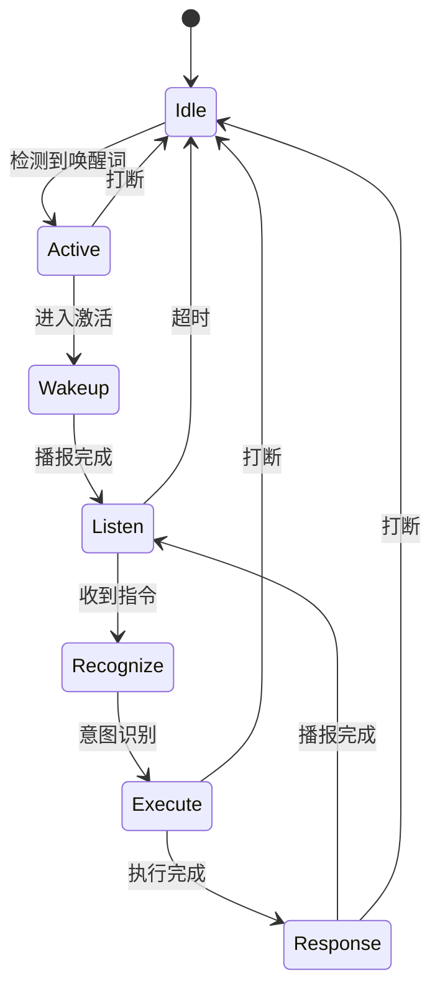

# 语音助手系统 - 基于 py_trees 行为树实现

一个可随时打断唤醒的语音对话服务，完整实现了 **待机→唤醒→播报→监听→识别→执行→播报→待机** 的循环流程。

## 特性

- ✅ **唤醒词检测**: 说"你好助手"唤醒系统
- ✅ **多指令支持**: 摄像头控制、天气查询、音乐播放等
- ✅ **随时打断**: 任何时候说"停止"立即回到待机
- ✅ **超时待机**: 10秒无输入自动休眠
- ✅ **连续对话**: 完成指令后继续监听，无需重复唤醒
- ✅ **行为树架构**: 使用 py_trees 实现清晰的状态管理

## 快速开始

### 1. 安装依赖

```bash
# 安装 Python 依赖
uv sync

# Linux 系统需要安装 TTS 引擎
sudo apt-get install espeak

# 可选：安装 graphviz 用于可视化行为树
sudo apt-get install graphviz
```

### 2. 准备 Vosk 模型

下载中文语音识别模型：
```bash
# 下载小模型（~40MB）
wget https://alphacephei.com/vosk/models/vosk-model-small-cn-0.22.zip
unzip vosk-model-small-cn-0.22.zip -d model/

# 或下载大模型（~1.8GB，识别更准确）
wget https://alphacephei.com/vosk/models/vosk-model-cn-0.22.zip
```

### 3. 配置路径

编辑 `config.py`，设置模型路径：
```python
VOSK_MODEL_PATH = "/path/to/your/vosk/model"
```

### 4. 运行程序

```bash
python voice_assistant.py
```

### 5. 开始使用

```
[待机] 聆听唤醒词...
YOU: "你好助手"
BOT: "我在，请说"

YOU: "打开摄像头"
BOT: [打开摄像头窗口]
BOT: "摄像头已打开，按q关闭"

YOU: (按 'q')
BOT: [监听] 等待指令...

YOU: "查询天气"
BOT: "今天天气晴朗，温度25度"

YOU: "停止"
BOT: [回到待机]
```

## 项目结构

```
.
├── voice_assistant.py       # 主程序（完整实现）
├── config.py                # 配置文件（可调参数）
├── test_voice_assistant.py  # 测试指南脚本
├── visualize_tree.py        # 行为树可视化工具
├── USAGE.md                 # 详细使用文档
├── README_VOICE_ASSISTANT.md # 本文件
├── main.py                  # 原始示例代码
└── model/                   # Vosk 模型目录
    └── small/               # 中文小模型
```

## 核心文件说明

### voice_assistant.py
完整的语音助手实现，包含：
- 9 个行为树节点类
- Selector + Parallel + Sequence 组合结构
- 黑板数据管理
- 完整的生命周期管理

### config.py
集中的配置管理：
- 唤醒词/打断词列表
- 超时阈值
- TTS 参数
- 意图识别模式
- 日志级别等

### test_voice_assistant.py
交互式测试指南：
```bash
python test_voice_assistant.py
```
提供 6 种测试场景的详细说明。

### visualize_tree.py
行为树可视化：
```bash
python visualize_tree.py
```
生成 ASCII 树、详细说明和图形化表示。

## 架构设计

### 行为树结构

```
Root (Selector)
├── IdleState (待机)
│   └── WakeWordDetector
└── ActiveState (激活)
    └── Parallel (可打断)
        ├── InterruptMonitor (并行监听打断)
        └── DialogLoop (对话循环)
            ├── PlayWakeupSound
            ├── ListenForCommand
            ├── RecognizeIntent
            ├── ExecuteAction (Selector)
            │   ├── OpenCameraAction
            │   ├── QueryWeatherAction
            │   ├── PlayMusicAction
            │   └── UnknownCommandResponse
            ├── PlayResponseSound
            └── CheckDialogTimeout
```

### 状态流转



### 关键技术点

1. **Parallel 实现打断**
   - `ParallelPolicy.SuccessOnOne`: 任一子节点成功，整个并行节点成功
   - `InterruptMonitor` 检测到打断 → 整个对话流程终止

2. **Selector 实现状态切换**
   - 优先执行待机状态
   - 检测到唤醒词 → 切换到激活状态
   - `memory=True` 保持状态

3. **Sequence 实现流程控制**
   - `memory=False` 支持循环重置
   - 顺序执行对话步骤
   - 任一步骤失败终止序列

4. **Blackboard 实现数据共享**
   - 命名空间隔离: `namespace="dialog"`
   - 访问控制: `READ` / `WRITE`
   - 节点间数据传递

## 支持的指令

| 指令          | 关键词           | 功能           |
|--------------|-----------------|----------------|
| 打开摄像头    | 打开 + 摄像头    | 显示实时画面    |
| 查询天气      | 天气 或 温度     | 播报天气信息    |
| 播放音乐      | 播放 + 音乐      | 播放音乐提示    |
| 停止/退出     | 停止/退出/休眠   | 回到待机状态    |

## 自定义配置

### 修改唤醒词

编辑 `config.py`:
```python
WAKE_WORDS = [
    "你好助手",
    "小助手",
    "嘿小智",  # 添加自定义唤醒词
]
```

### 调整超时时间

```python
DIALOG_TIMEOUT = 15  # 改为 15 秒
```

### 添加新指令

1. 在 `config.py` 添加意图模式：
```python
INTENT_PATTERNS = {
    "open_light": ["打开", "灯"],  # 新指令
}
```

2. 在 `voice_assistant.py` 创建动作节点：
```python
class OpenLightAction(py_trees.behaviour.Behaviour):
    def update(self):
        intent = self.blackboard.intent
        if intent != "open_light":
            return py_trees.common.Status.FAILURE
        # 执行开灯逻辑
        self.blackboard.response_text = "灯已打开"
        return py_trees.common.Status.SUCCESS
```

3. 添加到动作选择器：
```python
action_selector.add_children([
    OpenLightAction(),  # 添加新动作
    OpenCameraAction(),
    # ...
])
```

## 调试

### 启用详细日志

在 `voice_assistant.py` 中：
```python
log_tree.Level = log_tree.Level.DEBUG
```

### 可视化行为树

```bash
python visualize_tree.py
```

### 测试单个节点

```python
detector = WakeWordDetector()
detector.setup()
status = detector.update()
```

## 常见问题

### Q: 麦克风无法识别？

**A**: 检查麦克风设备：
```python
import speech_recognition as sr
print(sr.Microphone.list_microphone_names())
```

### Q: TTS 播报失败？

**A**: Linux 安装 espeak：
```bash
sudo apt-get install espeak
```

### Q: 唤醒词识别不准？

**A**: 
1. 下载更大的 Vosk 模型
2. 调整 `config.py` 中的 `ENERGY_THRESHOLD`
3. 增加唤醒词变体

### Q: 打断延迟？

**A**: 降低 `config.py` 中的 `INTERRUPT_TIMEOUT`:
```python
INTERRUPT_TIMEOUT = 0.3  # 从 0.5 降低到 0.3
```

## 性能优化

1. **减少模型加载**：多个节点共享同一个 Vosk 模型实例
2. **异步 TTS**：使用线程避免阻塞
3. **调整心跳间隔**：`TICK_INTERVAL = 0.05` (降低 CPU 占用)

## 扩展方向

- [ ] 接入真实天气 API
- [ ] 集成音乐播放器
- [ ] 支持智能家居控制
- [ ] 添加上下文理解（多轮对话）
- [ ] 集成大语言模型（LLM）
- [ ] Web 界面控制面板
- [ ] 移动端 App

## 技术栈

- **行为树**: py_trees 2.4+
- **语音识别**: Vosk 0.3+ (离线)
- **TTS**: pyttsx3 2.91+ (离线)
- **音频**: SpeechRecognition, PyAudio
- **视觉**: OpenCV 4.13+
- **Python**: 3.12+

## 许可

MIT License

## 参考资料

- [py_trees 文档](https://py-trees.readthedocs.io/)
- [Vosk 语音识别](https://alphacephei.com/vosk/)
- [行为树设计模式](https://en.wikipedia.org/wiki/Behavior_tree_(artificial_intelligence))

## 作者

创建于 2026-02-06

## 贡献

欢迎提交 Issue 和 Pull Request!
